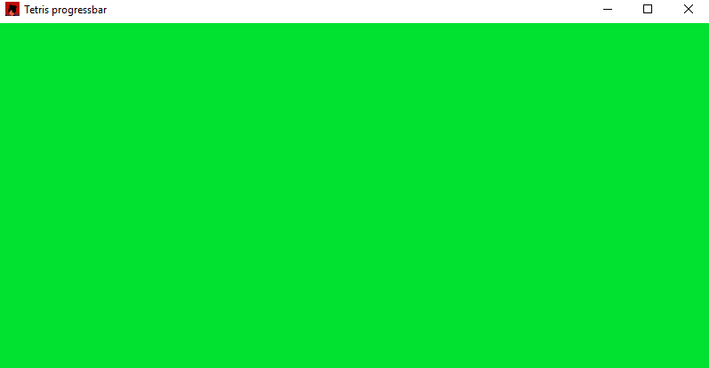

# Tetris progressbar

Random animation I came up with.

Image is constructed using a formula, meaning no states are used.  
You can freely switch between different progress states by setting `step` variable and then calling `update_image`.  
Percentage progress can be described as `step / max_step`.

